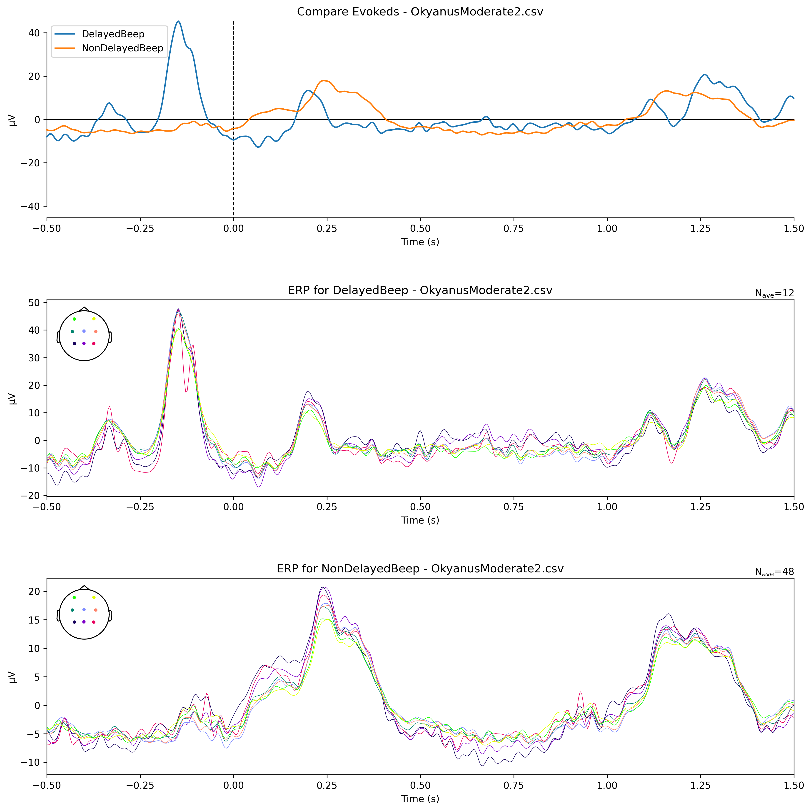

# NeuroTech ML: EEG Analysis of Stress Anticipation

A machine learning project for analyzing EEG data to detect and classify stress response anticipation during delayed auditory stimulus anticipation.

## Project Overview

This project examines how the brain responds to stress when anticipating delayed auditory stimuli. The analysis focuses on the relationship between delta (1-4 Hz) and beta (13-30 Hz) frequency bands, which has been linked to stress regulation.

The experiment presented participants with two types of auditory beeps:
- **DelayedBeep**: Stress-inducing delayed tone
- **NonDelayedBeep**: Control, normal tone

Using EEG recordings from multiple participants (Andy, Joycelynn, Okyanus), we analyzed the brain's electrical activity to classify these different states.

## Key Findings

- **Average classification accuracy**: 76.48%
- **Highest accuracy**: 81.67% (JoycelynModerate2)
- **All recordings achieved above-chance accuracy**: Ranging from 68.33% to 81.67%

This demonstrates that the EEG patterns associated with delayed and non-delayed conditions are distinct and can be reliably differentiated using Common Spatial Patterns (CSP) and Linear Discriminant Analysis (LDA) techniques.


*Example visualization from OkyanusModerate2 recording, showing comparison of evoked responses and individual ERPs*

## Repository Structure

- `csvs/`: Contains the EEG data CSV files
- `results/`: Analysis results for each recording
   - Log files with detailed metrics
   - Visualization images
- `analysis.py`: Main analysis script
- `venv/`: Python virtual environment (not included in git)

## Methodology

The analysis pipeline includes:
1. Loading and preprocessing EEG data
2. Extracting and cleaning event markers
3. Creating MNE Raw objects and applying filters (1-30 Hz)
4. Performing ICA for artifact removal
5. Creating epochs around events of interest
6. Computing band power (delta and beta)
7. ML classification using CSP + LDA
8. Visualization of evoked responses

## Usage

To analyze EEG data:

1. Place CSV files in the `csvs/` folder
2. Run the analysis script:
   ```bash
   python3 analysis.py
   ```
3. View results in the `results/` folder

## Technical Details

- **Sampling rate**: 250 Hz
- **EEG channels**: P4, Pz, P3, C3, Cz, C4, F3, F4
- **Filtering**: 1.0-30.0 Hz
- **Epoch window**: -0.5 to 1.5 seconds around events
